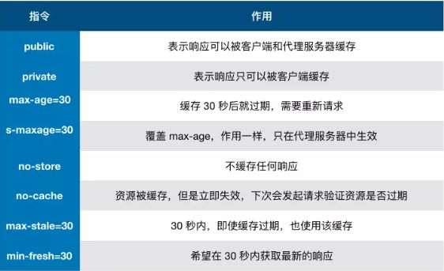

# 缓存策略

1. 使用 `webpack` 等工程化工具对静态资源使用 `hash` 指纹进行版本管理。  
2. `Html` 页面使用**协商缓存**，当服务端无更新时，返回 `304`；有更新时，返回新内容。  
3. 静态资源（js,img,css等）使用**强制缓存**：`Cache-Control: public, max-age=31536000`，有效期：1年。

原理：如果静态资源有变化(比如修改了JS内容，或者修改了图片)，会导致引用它的静态页面会被修改，因为引用资源的 `hash` 变了。所以静态页面需要使用**协商缓存**。浏览器就会拿到最新的静态页面，就会加载带新 `hash` 的静态资源，以此保障前端的资源是最新的。

## Cache-Control
`Cache-Control` 可以在请求头或者响应头中设置，并且可以组合使用多种指令：

  

注意：如果设置了多个，会根据优先级生效。 `no-store` 优先级最高。

### public 和 private 的选择
如果你用了 `CDN`，建议设置 `Cache-Control` 的值为 `public` ，以提升缓存命中率。  
如果定义了 `max-age` ，可以不用再定义 `public`。

## 设置方式
优先级：强制缓存 > 协商缓存

### 1. 频繁变动的资源 - 协商缓存
```javascript
Cache-Control: no-cache
```
对于频繁变动的资源（比如 `html` 页面等），首先需要使用 `Cache-Control:no-cache` 使浏览器每次都请求服务器，然后配合 `ETag` 或者 `Last-Modified` 来验证资源是否有效。这样的做法虽然不能节省请求数量，但是能显著减少响应数据大小。

> 协商缓存，如果资源无变化，响应码为 `304`
> `Last-Modified` 一般不需要单独设置，服务端自动返回。


### 2. 不常变化的资源 - 强制缓存
```javascript
Cache-Control: max-age=31536000 // 1年
```
通常在处理这类资源时（比如 `js`，`img`，`css` 等），给它们的 `Cache-Control` 配置一个很大的 `max-age=31536000` (一年) 缓存时间，这样浏览器之后请求相同的 `URL` 会命中强制缓存。

## 3. 强制不缓存，每次从服务端获取资源
```javascript
Cache-Control: no-store
```


## 用户行为对浏览器缓存的影响
 
指的就是用户在浏览器如何操作时，会触发怎样的缓存策略。主要有 3 种：  

1. 打开网页，地址栏输入地址： 查找 `disk cache` 中是否有匹配。如有则使用；如没有则发送网络请求。  
2. 普通刷新 (F5)：因为 `TAB` 并没有关闭，因此 `memory cache` 是可用的，会被优先使用(如果匹配的话)。其次才是 `disk cache`。  
3. 强制刷新 (Ctrl + F5)：浏览器不使用缓存，因此发送的请求头部均带有 `Cache-control:no-cache` (为了兼容，还带了 `Pragma:no-cache` ),服务器直接返回 `200` 和最新内容。