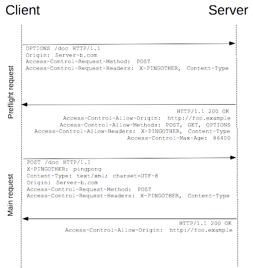

# CORS 跨域资源共享
CORS是一个W3C标准，全称是"跨域资源共享"（Cross-origin resource sharing）。   
参考：[HTTP访问控制（CORS）(https://developer.mozilla.org/zh-CN/docs/Web/HTTP/Access_control_CORS)](https://developer.mozilla.org/zh-CN/docs/Web/HTTP/Access_control_CORS)

> 跨域资源共享(CORS) 是一种机制，它使用额外的 `HTTP` 头来告诉**浏览器**让运行在一个 `origin (domain)` 上的Web应用被准许访问来自不同源服务器上的指定的资源。当一个资源从与该资源本身所在的服务器不同的域或端口请求一个资源时，资源会发起一个跨域 HTTP 请求。  
> 出于安全原因，浏览器限制从脚本内发起的跨源HTTP请求。 例如，XMLHttpRequest和Fetch API遵循同源策略。 这意味着使用这些API的Web应用程序只能从加载应用程序的同一个域请求HTTP资源，除非使用CORS头文件。  
> “简单请求”不会触发CORS预检请求。 [详见:简单请求]  (https://developer.mozilla.org/zh-CN/docs/Web/HTTP/Access_control_CORS#%E7%AE%80%E5%8D%95%E8%AF%B7%E6%B1%82)  

由上可见，对资源的跨域访问是由浏览器参与完成（无论成功/失败）。

## 跨域访问实现原理  
对于跨域请求，首先会由浏览器发起一个预检请求（[HTTP 请求方法](https://developer.mozilla.org/zh-CN/docs/Web/HTTP/Methods)  是OPTIONS），若服务端返回成功，浏览器才会发送实际请求，若服务端返回失败，则浏览器抛出一个错误。如下图所示： 
 


## 代码示例

```javascript
// node+express 服务端示例代码
app.use(function (req, res, next) {
  res.set({
    "Access-Control-Allow-Origin": "*",
    "Access-Control-Allow-Methods": "GET,POST",
    "Access-Control-Allow-Credentials": true,
    "Access-Control-Allow-Headers": "Content-Type,X-Requested-With",
  })
  next();
});
```
## 参数解释

1.Access-Control-Allow-Origin: 该字段必填。表示允许任何域名跨域访问，可指定一个固定域名；  
2.Access-Control-Allow-Methods：该字段必填。GET,POST 规定允许的方法，建议控制严格些，不要随意放开DELETE之类的权限；  
3.Access-Control-Allow-Credentials：该字段可选。它的值是一个布尔值，表示是否允许发送Cookie。   
默认情况下，Cookie不包括在CORS请求之中。设为true，即表示服务器明确许可，Cookie可以包含在请求中，一起发给服务器。这个值也只能设为true，如果服务器不要浏览器发送Cookie，删除该字段即可。  
4.Access-Control-Allow-Headers：该字段可选。用于预检请求的响应。其指明了实际请求中允许携带的首部字段。  
5.Access-Control-Max-Age：指定了preflight请求的结果能够被缓存多久。  
> 返回结果可以用于缓存的最长时间，单位是秒。在Firefox中，上限是24小时 （即86400秒），而在Chromium 中则是10分钟（即600秒）。Chromium 同时规定了一个默认值 5 秒。
> 如果值为 -1，则表示禁用缓存，每一次请求都需要提供预检请求，即用OPTIONS请求进行检测。

## 浏览器支持
只是IE8/9是借由XDomainRequest对象完成，IE10提供了对规范的完整支持，其他基本都支持。  
详细Desktop/Mobile支持见[浏览器兼容性](https://developer.mozilla.org/zh-CN/docs/Web/HTTP/Access_control_CORS#%E6%B5%8F%E8%A7%88%E5%99%A8%E5%85%BC%E5%AE%B9%E6%80%A7)