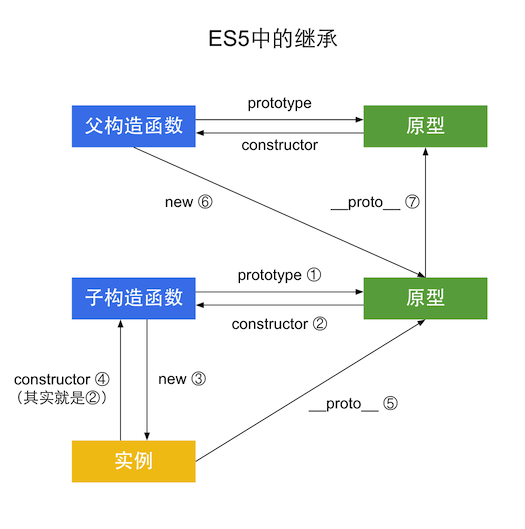
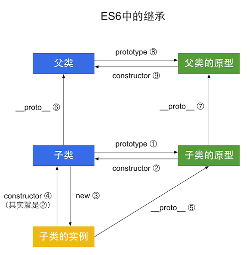
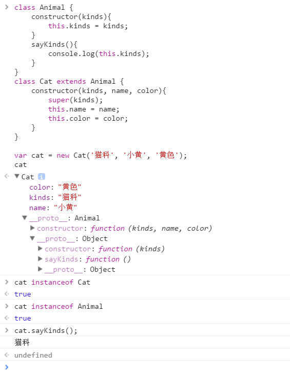

# ES6中的继承

ES6中新增了 `class` 和 `extends`，来实现类和继承。

[查看ES5的继承](js-inherit.md)

## ES5

我们先来看看ES5的继承:



```javascript
function Super() {}

function Sub() {}
Sub.prototype = new Super();
Sub.prototype.constructor = Sub;

var sub = new Sub();

Sub.prototype.constructor === Sub; // ② true
sub.constructor === Sub; // ④ true
sub.__proto__ === Sub.prototype; // ⑤ true
Sub.prototype.__proto__ == Super.prototype; // ⑦ true
```
ES5中这种最简单的继承，实质上就是将子类的原型设置为父类的实例。

## ES6  

ES6中的继承：


```javascript
class Super {}

class Sub extends Super {}

var sub = new Sub();

Sub.prototype.constructor === Sub; // ② true
sub.constructor === Sub; // ④ true
sub.__proto__ === Sub.prototype; // ⑤ true
Sub.__proto__ === Super; // ⑥ true
Sub.prototype.__proto__ === Super.prototype; // ⑦ true
```

## 所以
ES6和ES5的继承是一模一样的，只是多了 `class` 和 `extends` ，ES6的子类和父类，子类原型和父类原型，通过 `__proto__` 连接。

## 实例

如果子类中有`constructor`构造函数，则必须在 `constructor`方法中调用 `super`方法,否则新建实例时会报错(this is not defined)。  
这是因为子类没有自己的 `this` 对象，而是继承父类的 `this` 对象，然后对其进行加工。如果不调用`super`方法，子类就得不到 `this` 对象。

```javascript
class Animal {
	constructor(kinds){
		this.kinds = kinds;
	}
	sayKinds(){
		console.log(this.kinds);
	}
}
class Cat extends Animal {
	constructor(kinds, name, color){
		super(kinds);
		this.name = name;
		this.color = color;
	}
}

var cat = new Cat('猫科', '小黄', '黄色');
```


