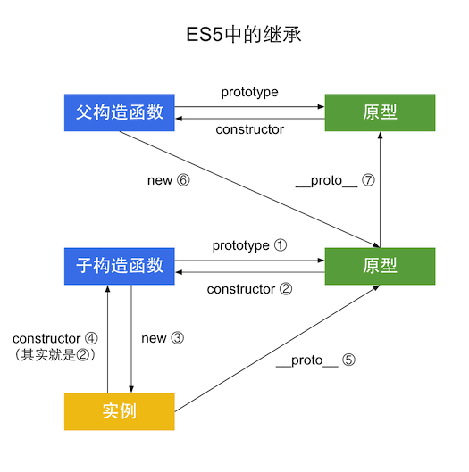

# 继承（ES5）
这部分是讲解ES6之前的JS继承，因为在ES6之前JS是没有“类”的，在ES6中定义了类 `class` 和 `extends`，可以很轻松的来实现继承。  

[查看ES6的继承](js-inherit-es6.md)

继承和原型及构造函数是分不开的，我们先来了解一下原型。  

## 原型
JS中所有的函数都有一个`prototype`属性，该属性引用了一个对象，即原型对象，也简称原型。
```javascript
function F(){};
console.log(F.prototype instanceof Object); //true
```


## 构造函数


```javascript
function Animal(kinds){
	this.kinds = kinds;
};
var obj = new Animal("动物");
```
实例化obj对象有以下步骤：  
```javascript
//1. 创建 obj 对象：obj = new Object(); 此时 obj 是一个空对象`{}`。他继承自 Animal.prototype。
var obj = {};
obj.__proto__ = Animal.prototype;
//2. 方法的this，指向空对象
//3. 运行构造方法
{}.kinds = kinds;
//4. 返回该对象
Animal.call(obj);
```
当这完成后，这个 obj 对象就与构造函数 Animal 再无联系，这个时候即使构造函数Animal再加任何成员，都不再影响已经实例化的obj对象了。此时，obj对象具有了kinds属性，同时具有了构造函数Animal的**原型对象**的所有成员。  
此时该原型对象是没有成员的，因为现在Animal是没有原型对象成员的。看下面的代码：  
```javascript
function Animal(kinds){
	this.kinds = kinds;
};
Animal.prototype.sayHi = function(){
	console.log('Hi');
}
var obj = new Animal("动物");
Animal.prototype.sayKinds = function(){
	console.log(this.kinds);
}
```
运行结果：  

  

此时obj就具有了构造函数原型对象成员，并且无论是在obj实例化前还是实例化后添加到构造函数的原型对象成员，在obj上都具有。  
但是如果给构造函数添加成员（属性或方法），obj是不会具有该成员的。  


## 继承
下面来看继承。  
1. 原型继承  
2. 借用构造函数  
3. 组合继承  
4. 寄生组合继承（最佳方式）  

其实继承还有很多其他方法，比如：1. 父类实例化后作为子类实例返回。 2. 拷贝父类属性等等，但是这些方法都很奇葩，最好别用，所以这里不做介绍。

### 1. 原型继承

相信看了前面已经大致了解原型继承了，下面我们来看如何让子构造函数继承父构造函数的成员。
```javascript
function Animal(kinds){
	this.kinds = kinds;
};
Animal.prototype.sayKinds = function(){
	console.log(this.kinds);
}
//定义一个子构造函数
var Cat = function(name, color){
	this.name = name;
	this.color = color;
}
Cat.prototype = new Animal('猫科');

var cat = new Cat('小黄', '黄色');
```

 特点：  
1. 非常纯粹的继承关系，实例是子类的实例，也是父类的实例。  
2. 父类新增原型方法/属性，子类都能访问到。  
3. 简单，一句话实现。  

缺点：
1. 来自原型对象的**引用属性**是所有实例共享的。  
2. 创建子类实例时，无法向父类构造函数传参。  
3. 无法实现多继承。  

### 2.借用构造函数
```javascript
function Animal(kinds){
	this.kinds = kinds;
};
Animal.prototype.sayKinds = function(){
	console.log(this.kinds);
}

var Cat = function(name, color){
	Animal.call(this, '猫科'); //可在实例化时通过参数传入了。
	this.name = name;
	this.color = color;
}

var cat = new Cat('小黄', '黄色');
```

  

特点：  
1. 解决了1中，子类实例共享父类引用属性的问题。  
2. 创建子类实例时，可以向父类传递参数  
3. 可以实现多继承（call多个父类对象）  

缺点：  
1. 实例并不是父类的实例，只是子类的实例  
2. 只能继承父类的实例属性和方法，不能继承原型属性和方法  
3. 无法实现函数复用，每个子类都有父类实例函数的副本，影响性能  

### 3. 组合继承
这是比较常用的一种方法。
```javascript
function Animal(kinds){
	this.kinds = kinds || "动物";
};
Animal.prototype.sayKinds = function(){
	console.log(this.kinds);
}

var Cat = function(name, color){
	Animal.call(this, '猫科');
	this.name = name;
	this.color = color;
}
Cat.prototype = new Animal();

var cat = new Cat('小黄', '黄色');
```


特点：  
1. 弥补了方式2的缺陷，可以继承实例属性/方法，也可以继承原型属性/方法  
2. 既是子类的实例，也是父类的实例  
3. 不存在引用属性共享问题  
4. 可传参  
5. 函数可复用  

缺点：  
1. 调用了两次父类构造函数，生成了两份实例，多占用了内存（子类实例将子类原型上的那份屏蔽了）  

### 4. 寄生组合继承
这是最佳方式，只是实现稍微复杂一点。
```javascript
function Animal(kinds){
	this.kinds = kinds || "动物";
};
Animal.prototype.sayKinds = function(){
	console.log(this.kinds);
}

var Cat = function(name, color){
	Animal.call(this, '猫科');
	this.name = name;
	this.color = color;
}
(function(){
	var f = function(){}; //声明一个空对象（函数即对象）
	f.prototype = Animal.prototype;
	Cat.prototype = new f(); //将实例作为子类的原型

	//相当于就是实现将父类的原型成员赋给子类。
})();

var cat = new Cat('小黄', '黄色');
```
  

该方法堪称完美，只是实现较为复杂。

## 结论：

ES5中这种最简单的继承，实质上就是将子类的原型设置为父类的实例。

  

[查看ES6的继承](js-inherit-es6.md)
