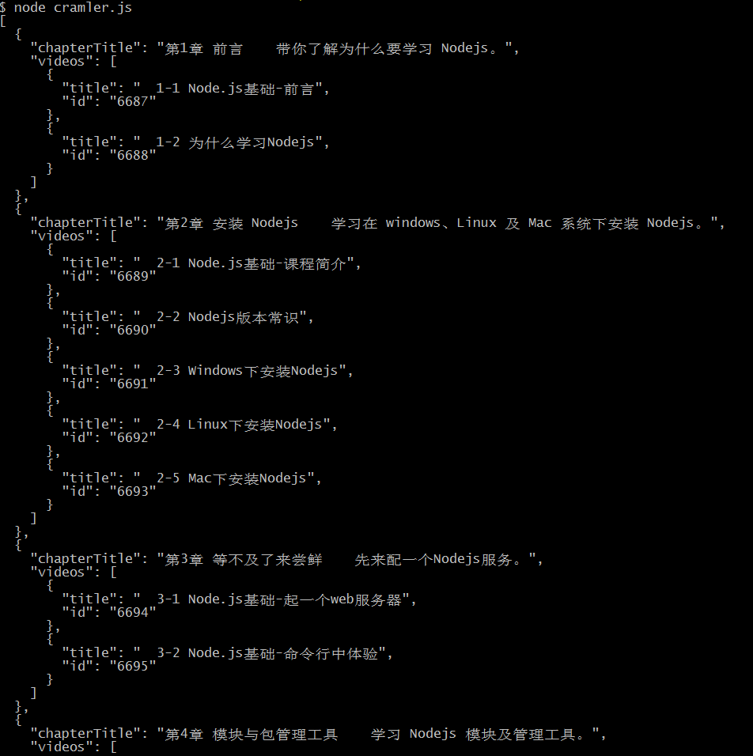

# node插件之cheerio

cheerio是nodejs的抓取页面模块，为服务器特别定制的，快速的、灵活的、优雅的jQuery核心实现。所以cheerio的接口和jquery非常相似。  


## API:
[官网 - 英文](https://www.npmjs.com/package/cheerio)  
[中文版本](http://www.cnblogs.com/CraryPrimitiveMan/p/3674421.html)


## 示例

```javascript
//cramler.js

const http = require("http");
const cheerio = require("cheerio");
const url = 'http://www.imooc.com/learn/348';

function filterChapters(html) {
	let $ = cheerio.load(html, {
		ignoreWhitespace: true,
		xmlMode: true,
	});
	let chapters = $('.chapter');
	// 期望的数据格式
	// [
	// 	{
	// 		chapterTitle: '',
	// 		videos: [
	// 			title: '',
	// 			id: ''
	// 		]
	// 	},
	// 	...
	// ]

	let courseData = [];

	chapters.each((i, el)=>{
		let chapter = $(el);
		let chapterTitle = chapter.find('strong').text().trim();
		let videos = chapter.find('.video li');
		let chapterData = {
			chapterTitle: chapterTitle,
			videos: []
		}
		videos.each((i, el)=>{
			let video = $(el).find('.J-media-item');
			let videoTitle = video.text().split(' (')[0];
			let id = video.attr('href').split('video/')[1];
			chapterData.videos.push({
				title: videoTitle,
				id: id
			})
		})
		courseData.push(chapterData);
	})
	return courseData;
}

function printCouseInfo(courseData) {
	// courseData.forEach((item)=>{
	// 	console.log(item.chapterTitle + '\n');
	// 	item.videos.forEach((item)=>{
	// 		console.log(`[${item.id}]${item.title}`);
	// 	})
	// })
	console.log(JSON.stringify(courseData, null, 2));
}

http.get(url, (res)=>{
	let html = '';
	res.on('data', (data)=>{
		html += data;
	})
	res.on('end', ()=>{
		let courseData = filterChapters(html);
		printCouseInfo(courseData);
	})
}).on('error', ()=>{
	console.log('get error');
})
```
运行结果：



如果抓取不到数据，请确认官网是否改版（修改了对应的DOM结构或者className等），如果改版，将以上代码稍作修改即可。
