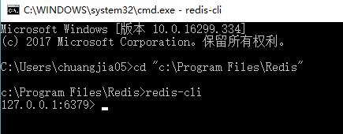

# Redis学习笔记
Redis是一个开源的使用ANSI C语言编写、支持网络、可基于内存亦可持久化的日志型、Key-Value数据库，并提供多种语言的API。  
> 注 - Redis命令不区分大小写，如 `SET` , `Set` 和 `set` 都是同一个命令。

## Redis的特点
- 异常快 - 每秒可以执行大约 `110000` 次的设置( `SET` )操作，每秒大约可执行 81000 次的读取/获取( `GET` )操作。
- 操作具有原子性 - 所有Redis操作都是原子操作，这确保如果两个客户端并发访问，Redis服务器能接收更新的值。
- 多使用工具 - Redis是一个多实用工具，可用于多种用例，如：缓存，消息队列（Redis本地支持发布/订阅），应用程序中的短期数据（会话，网页命中计数）等。
- 丰富的数据类型 - 与其他键值数据存储相比，Redis有一组相对丰富的数据类型，例如列表，哈希，集合，排序集合等。

## 下载及安装
[http://www.redis.cn/download.html#installation](http://www.redis.cn/download.html#installation)

### windos安装
[Windows下安装Redis服务](https://www.cnblogs.com/jaign/articles/7920588.html)

## 先上手（windows下）
1、在安装后，可直接在 `cmd` 中输入 `redis-cli` 进入客户端界面。  


在Redis的根目录下有一个配置文件（`redis.conf`）,可通过 `config` 命令获取和设置所有的 **Redis** 配置。  
2、通过 `config get *` 获取所有默认配置。  
```javascript
127.0.0.1:6379> config get *
  1) "dbfilename"
  2) "dump.rdb"
  3) "requirepass"
  4) "123456"
  5) "masterauth"
  6) ""
  7) "unixsocket"
  8) ""
  9) "logfile"
 10) "server_log.txt"
 11) "pidfile"
 12) ""
 13) "maxmemory"
 14) "104857600"
 15) "maxmemory-samples"
 16) "5"
 17) "timeout"
 18) "0"
 19) "auto-aof-rewrite-percentage"
 20) "100"
 21) "auto-aof-rewrite-min-size"
 22) "67108864"
 23) "hash-max-ziplist-entries"
 24) "512"
 25) "hash-max-ziplist-value"
 26) "64"
 27) "list-max-ziplist-size"
 28) "-2"
 29) "list-compress-depth"
 30) "0"
 31) "set-max-intset-entries"
 32) "512"
 33) "zset-max-ziplist-entries"
 34) "128"
 35) "zset-max-ziplist-value"
 36) "64"
 37) "hll-sparse-max-bytes"
 38) "3000"
 39) "lua-time-limit"
 40) "5000"
 41) "slowlog-log-slower-than"
 42) "10000"
 43) "latency-monitor-threshold"
 44) "0"
 45) "slowlog-max-len"
 46) "128"
 47) "port"
 48) "6379"
 49) "tcp-backlog"
 50) "511"
 51) "databases"
 52) "16"
 53) "repl-ping-slave-period"
 54) "10"
 55) "repl-timeout"
 56) "60"
 57) "repl-backlog-size"
 58) "1048576"
 59) "repl-backlog-ttl"
 60) "3600"
 61) "maxclients"
 62) "10000"
 63) "watchdog-period"
 64) "0"
 65) "slave-priority"
 66) "100"
 67) "min-slaves-to-write"
 68) "0"
 69) "min-slaves-max-lag"
 70) "10"
 71) "hz"
 72) "10"
 73) "cluster-node-timeout"
 74) "15000"
 75) "cluster-migration-barrier"
 76) "1"
 77) "cluster-slave-validity-factor"
 78) "10"
 79) "repl-diskless-sync-delay"
 80) "5"
 81) "tcp-keepalive"
 82) "0"
 83) "cluster-require-full-coverage"
 84) "yes"
 85) "no-appendfsync-on-rewrite"
 86) "no"
 87) "slave-serve-stale-data"
 88) "yes"
 89) "slave-read-only"
 90) "yes"
 91) "stop-writes-on-bgsave-error"
 92) "yes"
 93) "daemonize"
 94) "no"
 95) "rdbcompression"
 96) "yes"
 97) "rdbchecksum"
 98) "yes"
 99) "activerehashing"
100) "yes"
101) "protected-mode"
102) "yes"
103) "repl-disable-tcp-nodelay"
104) "no"
105) "repl-diskless-sync"
106) "no"
107) "aof-rewrite-incremental-fsync"
108) "yes"
109) "aof-load-truncated"
110) "yes"
111) "maxmemory-policy"
112) "noeviction"
113) "loglevel"
114) "notice"
115) "supervised"
116) "no"
117) "appendfsync"
118) "everysec"
119) "appendonly"
120) "no"
121) "dir"
122) "C:\\Program Files\\Redis"
123) "save"
124) "jd 900 jd 300 jd 60"
125) "client-output-buffer-limit"
126) "normal 0 0 0 slave 268435456 67108864 60 pubsub 33554432 8388608 60"
127) "unixsocketperm"
128) "0"
129) "slaveof"
130) ""
131) "notify-keyspace-events"
132) ""
133) "bind"
134) "127.0.0.1"
```
3、上一步中所有配置均可通过 `config set` 命令进行设置。 
```javascript
// redis 命令不区分大小写
127.0.0.1:6379> config set requirepass '123456'
OK
127.0.0.1:6379> auth 123456
OK
```
4、远程服务连接  
先讲下redis-cli的几个关键参数：  
用法：redis-cli [OPTIONS] [cmd [arg [arg ...]]]  
--help，显示帮助信息，通过help可以看到很多信息：  
-h <hostname>      Server hostname (default: 127.0.0.1).  
-p <port>          Server port (default: 6379).  
-s <socket>        Server socket (overrides hostname and port).  
-a <password>      Password to use when connecting to the server.  
...
```javascript
C:\Users\administrator>redis-cli -h 192.168.10.232 -p 7002
192.168.10.232:7002>

// 有权限控制时，加上(-a 密码)：
C:\Users\administrator>redis-cli -h 192.168.10.232 -p 7002 -a 123456
```
## 下面开始正式学习Redis命令
- [Redis数据类型](./data-types.md)
- [Redis命令](http://www.redis.cn/commands.html)

## node中使用Redis
在node中推荐使用 [redis](https://github.com/NodeRedis/node_redis) 库，[ioredis](https://github.com/luin/ioredis)在Star数、Fork数上都没有 `redis` 高。  
但是: 如果是redis集群，则需要使用 `ioredis`。