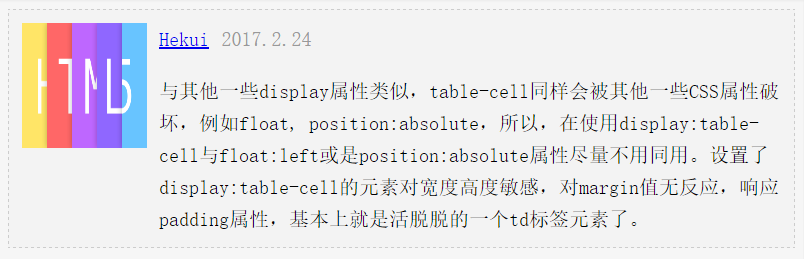

# table-cell

`display:table-cell` 属性指让标签元素以表格单元格的形式呈现，类似于 `td` 标签。
与其他一些`display`属性类似，`table-cell`同样会被其他一些CSS属性破坏，例如`float`, `position:absolute`，所以，在使用`display:table-cell`与`float:left`或是`position:absolute`属性尽量不用同用。设置了`display:table-cell`的元素对宽度高度敏感，对`margin`值无反应，响应`padding`属性，基本上就是一个`td`标签元素了。

`display:table-cell`的应用：  
1. 垂直居中  
2. 两栏自适应布局  
3. 等高布局  
4. 列表布局  
5. 等分列

## 1. 垂直居中
详见：[垂直居中:table-cell](vertical-middle.md#1-display-table-cell)

## 2. 两栏自适应布局
比如，我们需要实现如下效果：



左侧为头像，右侧内容自适应。这个效果很常见。可以用以下方法实现：
1. padding-left + position:absolute。
2. 左浮动 + margin-left。

还可以用`table-cell`实现。
demo见：[http://runjs.cn/code/wh6smlmu](http://runjs.cn/code/wh6smlmu)

## 3. 等高布局
可以实现以下等高布局。


demo见：[http://runjs.cn/code/pc0dt5d1](http://runjs.cn/code/pc0dt5d1)

 > CSS2.1表格模型中的元素，可能不会全部包含在除HTML之外的文档语言中。这时，那些“丢失”的元素会被模拟出来，从而使得表格模型能够正常工作。所有的表格元素将会自动在自身周围生成所需的匿名table对象，使其符合table/inline-table、table-row、table- cell的三层嵌套关系。

比如：如果我们为元素使用 `display:table-cell;` 属性，而不将其父容器设置为 `display:table-row;` 属性，浏览器会默认创建出一个表格行，就好像文档中真的存在一个被声明的表格行一样。（详见代码注释）

## 4. 列表布局
一般列表布局都是采用浮动的方法实现，多个元素左浮动，自动平铺及换行。  
但是浮动布局的不足在于：一是需要清除浮动造成的影响；二是不支持不定高列表的浮动。  

用`table-cell`也可以实现列表布局，但也有些复杂和局限的地方：一是需要确定每行多少列（局限之处，无法自动换行平铺）。二是每行需要用一个容器包裹（复杂之处，多加容器）。  
代码结构大致如下：
```html
<div class="container">
	<div class="row">
		<div class="cell">
			...
		</div>
		<div class="cell">
			...
		</div>
		<div class="cell">
			...
		</div>
	</div>
	<div class="row">
		<div class="cell">
			...
		</div>
		<div class="cell">
			...
		</div>
		<div class="cell">
			...
		</div>
	</div>
</div>
```

demo见：[display:table-cell实现的列表布局](http://www.zhangxinxu.com/study/201010/table-cell-list-flow-layout.html)


## 5. 等分列

display:table-cell下的列表布局最适用的场景是：列表个数不固定，但是，无论列表几个，都平分容器空间。什么意思呢？就是如果4个列表，希望每个宽度25%，3个就33.3333%，2个列表希望每个宽度50%。此时，没有比display:table-cell更合适的技术了。

demo见：[http://runjs.cn/code/llgzl3tl](http://runjs.cn/code/llgzl3tl)
