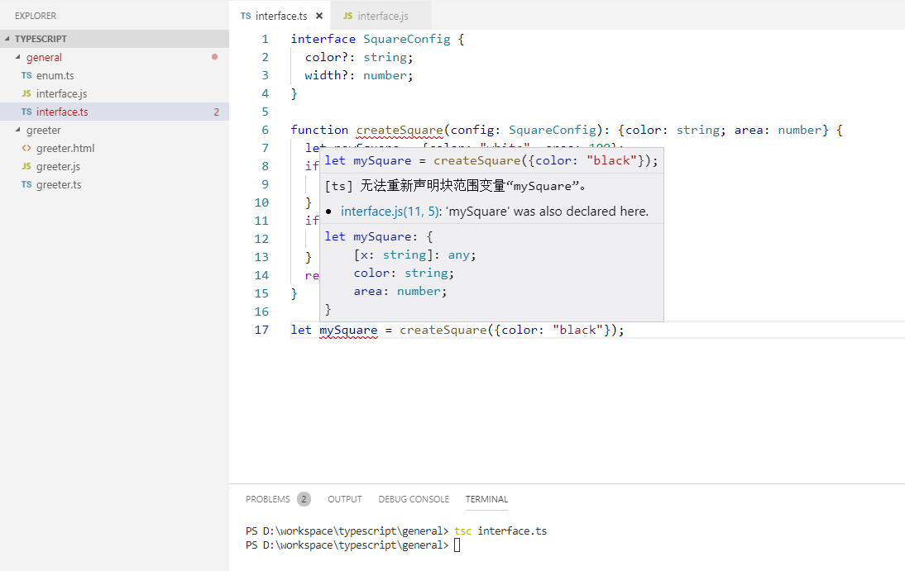

#TypeScript

参考：[TypeScript中文网](https://www.tslang.cn/)  
TypeScript是JavaScript类型的超集，它可以编译成纯JavaScript。  
TypeScript的文件扩展名：`ts`，`tsx`

## 安装
```javascript
npm install -g typescript
```
## 编译
TypeScript可以编译成纯JavaScript  
在命令行上，运行TypeScript编译器：
```javascript
tsc greeter.ts
```
输出结果为一个greeter.js文件。

## 语法
[官方手册](https://www.tslang.cn/docs/handbook/basic-types.html)  
[学习提炼](./basic-types.md)

## 工程化

TypeScript使用`tsconfig.json`文件管理工程配置。  
[tsconfig.json](./tsconfig.md)

与构建工具集成：  
1. [webpack](./webpack.md)  
2. [gulp](https://www.tslang.cn/docs/handbook/gulp.html)   

## 其他
在vscode中  
编写.ts文件，在执行 `tsc **.ts` 后，生成同名的 `**.js` 后，原始`.ts`文件在vscode中会出现错误提示（红色波浪线），如下图：  


解决办法：  
可以将`.ts`文件修改为一个模块，即在文件末尾加上导出模块功能。
```javascript
export = mySquare
```