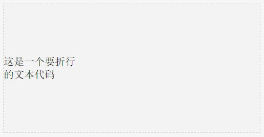

# 垂直居中

几种垂直居中的方法：  
1. display: table-cell  
2. 定位 + margin负值（需要是知道内容宽高）  
3. 定位 + translate  
4. line-height（多行文本在某一高度的容器中，垂直居中）  

要实现效果如下：  

  

## 1. display: table-cell
`display: table-cell` 属性是让元素以表格单元格的形式呈现，类似于 `td` 标签。  

 > `display: table-cell` 还有些其他很好的应用：
 > 1. 两栏自适应布局
 > 2. 等高布局
 > 3. 列表布局

 > 详见：[我所知道的几种display:table-cell的应用](http://www.zhangxinxu.com/wordpress/2010/10/%E6%88%91%E6%89%80%E7%9F%A5%E9%81%93%E7%9A%84%E5%87%A0%E7%A7%8Ddisplaytable-cell%E7%9A%84%E5%BA%94%E7%94%A8/)

demo见：[http://runjs.cn/code/5brnqzop](http://runjs.cn/code/5brnqzop)

html:
```html
<div class="container">
	<div class="content">
		这是一个要折行<br>的文本代码
	</div>
</div>
```
css:
```css
.container{
	width:400px; height:200px; background-color:#f3f3f3; border:1px #ccc dashed;
	display: table;
}
.content{
	display: table-cell;
	line-height: 20px;
	vertical-align: middle;
}
```

## 2. 定位 + margin负值  
该方法需要知道内容的宽和高，然后上边距是负的二分之一高：`margin-top: -(1/2)\*高`，左边距是负的二分之一宽：`margin-left: -(1/2)\*宽`。  
如果内容的宽高是不固定的，可用其他几种方法。  
demo见：[http://runjs.cn/code/vu4pvcxq](http://runjs.cn/code/vu4pvcxq)

html:
```html
<div class="container">
	<div class="content">
		这是一个要折行<br>的文本代码
	</div>
</div>
```
css:
```css
.container{
	width:400px; height:200px; background-color:#f3f3f3; border:1px #ccc dashed;
	position:relative;
}
.content{
	position: absolute;
	top: 50%; left: 50%;
	width: 200px; height: 40px; border: 1px solid #ddd;
	margin: -20px auto auto -100px;
}
```

## 3. 定位 + translate
通过css3的`transform: translate(-50%, -50%);`属性来实现。  
别忘记浏览器前缀：`-webkit-`, `-moz-`, `-ms-`, `-o-`等。  
demo见：[http://runjs.cn/code/ivcqj2rn](http://runjs.cn/code/ivcqj2rn)

html:
```html
<div class="container">
	<div class="content">
		这是一个要折行<br>的文本代码
	</div>
</div>
```
css:
```css
.container{
	width:400px; height:200px; background-color:#f3f3f3; border:1px #ccc dashed;
	position:relative;
}
.content{
	position: absolute;
	top: 50%; left: 50%; border: 1px solid #ddd;
	-webkit-transform: translate(-50%, -50%);
	transform: translate(-50%, -50%);
}
```
## 4. line-height

如果一个标签没有定义`height`属性(包括百分比高度)，那么其最终表现的高度一定是由`line-height`起作用。

demo见：[http://runjs.cn/code/4pwejbo0](http://runjs.cn/code/4pwejbo0)

html代码:
```html
<div class="container">
	<span>这是一个要折行<br>的文本代码</span>
	<i></i>
</div>
```
css代码：
```css
.container{
	width:400px; line-height:200px; background-color:#f3f3f3;
}
.container span{
	line-height:20px;
	display: inline-block;
	vertical-align: middle;
}
.container i{
	display: inline-block;
	vertical-align: middle;
}
```

扩展阅读：张鑫旭写的 [css行高line-height的一些深入理解及应用](http://www.zhangxinxu.com/wordpress/2009/11/css%E8%A1%8C%E9%AB%98line-height%E7%9A%84%E4%B8%80%E4%BA%9B%E6%B7%B1%E5%85%A5%E7%90%86%E8%A7%A3%E5%8F%8A%E5%BA%94%E7%94%A8/)
