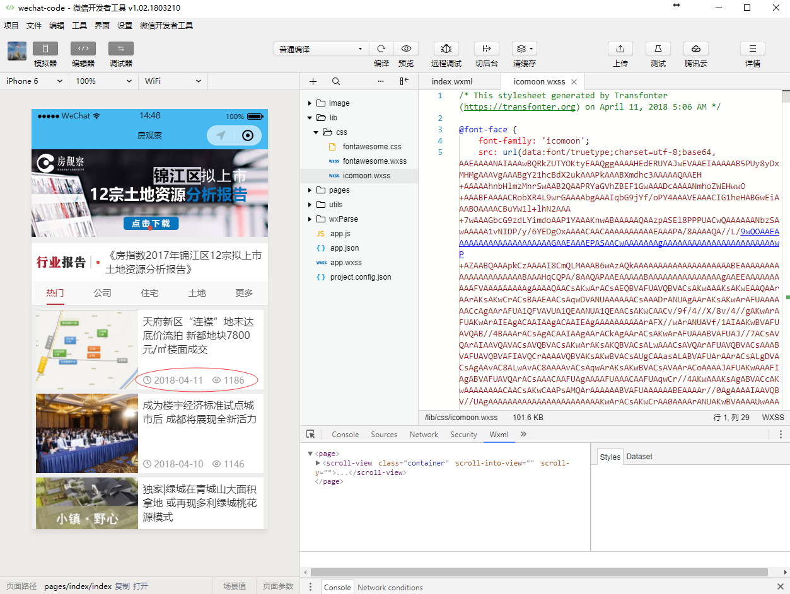
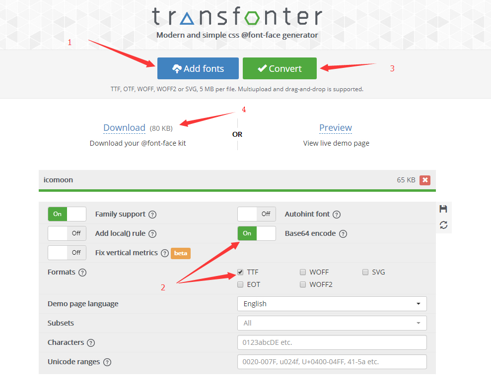
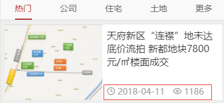

# 在小程序中使用iconfont 
先看看iconfont在小程序中的效果：  


## Why?
因为常见的iconfont是在css文件中引入字体文件（.ttf,.woff,.eot,.svg等），但是在小程序中是不支持的；  
但是小程序是支持base64的。


## How?
1. 下载相关iconfont图标，并解压，找到对应的 `.ttf` 文件。推荐使用：[icomoon.io](http://www.icomoon.io)，[icomoon字体图标使用方法]()。
2. 打开网站 [https://transfonter.org/](https://transfonter.org/) ，按照如下步骤转换。  
    1. 点击“Add fonts”，选择上一步的 `.ttf` 文件，等待上传完成。
    2. 选择“Base64 encode”，勾选“TTF”（可按需求勾选其他）。
    3. 点击“Convert”。
    4. Download  
    
3. 解压上一步下载的文件，拷贝出代码，类似如下：

```css
@font-face {
  font-family: 'icomoon';
  src: url(data:font/truetype;charset=utf-8;base64,AAEAAAANAIAAAwBQRkZUTYOKtyEAAQggAAAAHEdERUYAJwEVAAEIAAAAAB5PUy8y...) format('truetype');
  font-weight: normal;
  font-style: normal;
}
```

4. 替换掉原始引入 `.ttf` 文件的代码。
```css
// 替换前
@font-face {
  font-family: 'icomoon';
  src:  url('fonts/icomoon.eot?krh3o');
  src:  url('fonts/icomoon.eot?krh3o#iefix') format('embedded-opentype'),
    url('fonts/icomoon.ttf?krh3o') format('truetype'),
    url('fonts/icomoon.woff?krh3o') format('woff'),
    url('fonts/icomoon.svg?krh3o#icomoon') format('svg');
  font-weight: normal;
  font-style: normal;
}

[class^="icon-"], [class*=" icon-"] {
  /* use !important to prevent issues with browser extensions that change fonts */
  font-family: 'icomoon' !important;
  speak: none;
  font-style: normal;
  font-weight: normal;
  font-variant: normal;
  text-transform: none;
  line-height: 1;

  /* Better Font Rendering =========== */
  -webkit-font-smoothing: antialiased;
  -moz-osx-font-smoothing: grayscale;
}

.icon-activity:before {
  content: "\e900";
}
.icon-airplay:before {
  content: "\e901";
}
// 更多代码...
```

```css
// 替换后
@font-face {
  font-family: 'icomoon';
  src: url(data:font/truetype;charset=utf-8;base64,AAEAAAANAIAAAwBQRkZUTYOKtyEAAQggAAAAHEdERUYAJwEVAAEIAAAAAB5PUy8y...) format('truetype');
  font-weight: normal;
  font-style: normal;
}

[class^="icon-"], [class*=" icon-"] {
  /* use !important to prevent issues with browser extensions that change fonts */
  font-family: 'icomoon' !important;
  speak: none;
  font-style: normal;
  font-weight: normal;
  font-variant: normal;
  text-transform: none;
  line-height: 1;

  /* Better Font Rendering =========== */
  -webkit-font-smoothing: antialiased;
  -moz-osx-font-smoothing: grayscale;
}

.icon-activity:before {
  content: "\e900";
}
.icon-airplay:before {
  content: "\e901";
}
// 更多代码...
```

5. 最后将对应css文件，拷贝至小程序目录，修改后缀为 `.wxss` ，并在项目中引入代码即可使用。

```css
/**app.wxss**/
@import "./lib/css/icomoon.wxss";

page{
  color: #333;
  background-color: #eee;
  // ...
}
```

```html
<!--index.wxml-->
<text class="prop">
  <text class="icon icon-clock"></text> {{item.pubdate}} <text class="icon icon-eye" style="margin-left:20rpx;"></text> {{item.pv_num}}
</text>
```

效果如下：  
